# DSA Battle Tanks — System Documentation

> **Version:** 1.0 | **Engine:** Pygame | **Architecture:** Client-Server (TCP)

---

## Table of Contents

1. [High-Level System Architecture](#1-high-level-system-architecture)
2. [Low-Level System Architecture](#2-low-level-system-architecture)
3. [Module & File Reference](#3-module--file-reference)
4. [Gameplay Loop Flowchart](#4-gameplay-loop-flowchart)
5. [HUD Interaction Flowchart](#5-hud-interaction-flowchart)
6. [Player Input & Movement Flowchart](#6-player-input--movement-flowchart)
7. [Firing & Bullet Lifecycle Flowchart](#7-firing--bullet-lifecycle-flowchart)
8. [Collision Detection Flowchart](#8-collision-detection-flowchart)
9. [Ammo & Reload System Flowchart](#9-ammo--reload-system-flowchart)
10. [Fog of War (FOV) System Flowchart](#10-fog-of-war-fov-system-flowchart)
11. [Laser Skill Flowchart](#11-laser-skill-flowchart)
12. [Network Communication Flowchart](#12-network-communication-flowchart)
13. [Player Connection & Session Flowchart](#13-player-connection--session-flowchart)
14. [Game State Transition Flowchart](#14-game-state-transition-flowchart)
15. [Data Packet Structure](#15-data-packet-structure)

---

## 1. High-Level System Architecture

This diagram shows the two major runtime processes — the **Server** and each **Client** — and how they communicate over TCP.

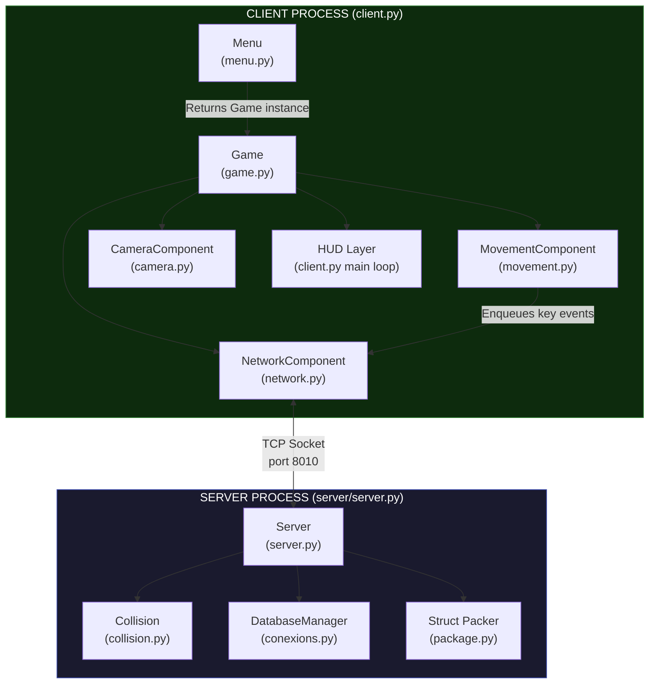

---

## 2. Low-Level System Architecture

This diagram expands every module, class, key method, and data flow.

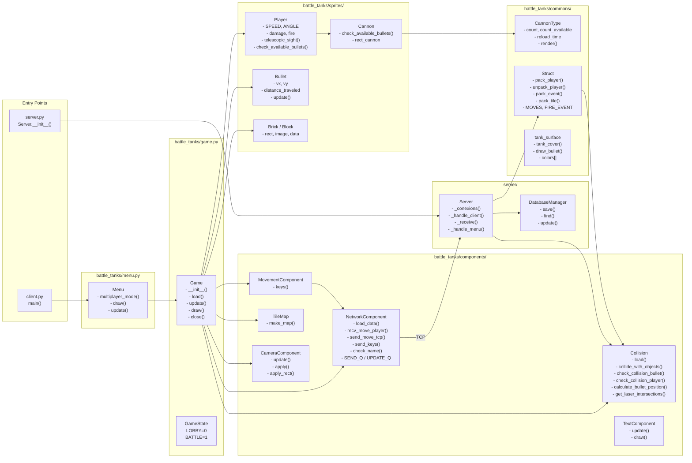

---

## 3. Module & File Reference

| File | Class / Function | Responsibility |
|------|-----------------|----------------|
| `client.py` | `main()` | Entry point; Pygame init, HUD render loop, thread spawning |
| `battle_tanks/menu.py` | `Menu` | Main menu, connection form, tank color picker |
| `battle_tanks/game.py` | `Game`, `GameState` | Game loop orchestration, Fog of War, draw pipeline |
| `battle_tanks/sprites/player.py` | `Player(Cannon)` | Tank entity, damage, fire flag, telescopic sight |
| `battle_tanks/sprites/cannon.py` | `Cannon` | Cannon rect, ammo availability check |
| `battle_tanks/sprites/elements.py` | `Brick`, `Block`, `Bullet` | Map objects and projectile sprite |
| `battle_tanks/commons/municion.py` | `CannonType` | Ammo count, reload timer, bullet render |
| `battle_tanks/commons/package.py` | `Struct` | Binary protocol — pack/unpack player, tile, and event data |
| `battle_tanks/commons/tank_surface.py` | `tank_cover()` | Draws tank body + cannon with color theming |
| `battle_tanks/components/network.py` | `NetworkComponent` | TCP socket, queues for send/receive |
| `battle_tanks/components/movement.py` | `MovementComponent` | Translates key presses → event bytes |
| `battle_tanks/components/collision.py` | `Collision` | Server-side physics, bullet-hit checks, boundary clamping |
| `battle_tanks/components/tile_map.py` | `TileMap` | Loads `.tmx` tile map, renders surface |
| `battle_tanks/components/camera.py` | `CameraComponent` | Scrolling camera offset, applies to sprites |
| `battle_tanks/components/text.py` | `TextComponent` | Pygame font surface helper |
| `server/server.py` | `Server` | TCP accept loop, per-client threads, game-state broadcast |
| `server/conexions.py` | `DatabaseManager` | JSON-based player persistence |

---

## 4. Gameplay Loop Flowchart

The main client loop runs at 60 FPS. This flowchart covers everything from startup to game exit.

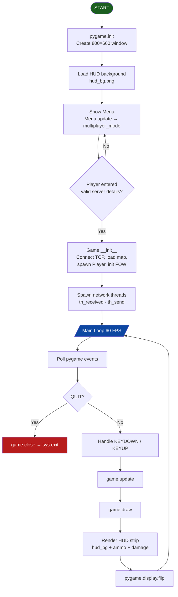

---

## 5. HUD Interaction Flowchart

The HUD is a 60-pixel strip rendered below the 800×600 game viewport. It shows ammo icons and damage percentage.

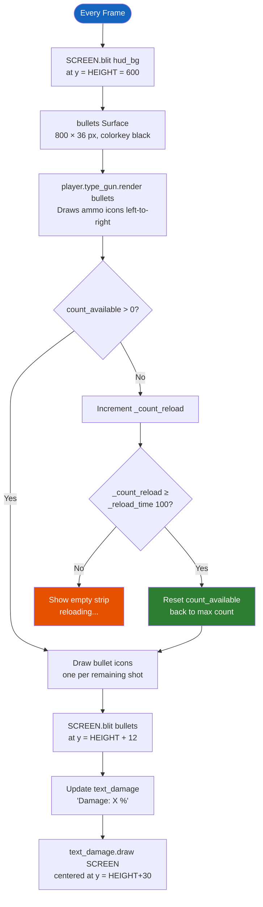

---

## 6. Player Input & Movement Flowchart

`MovementComponent.keys()` is called every frame inside `Game.update()`.

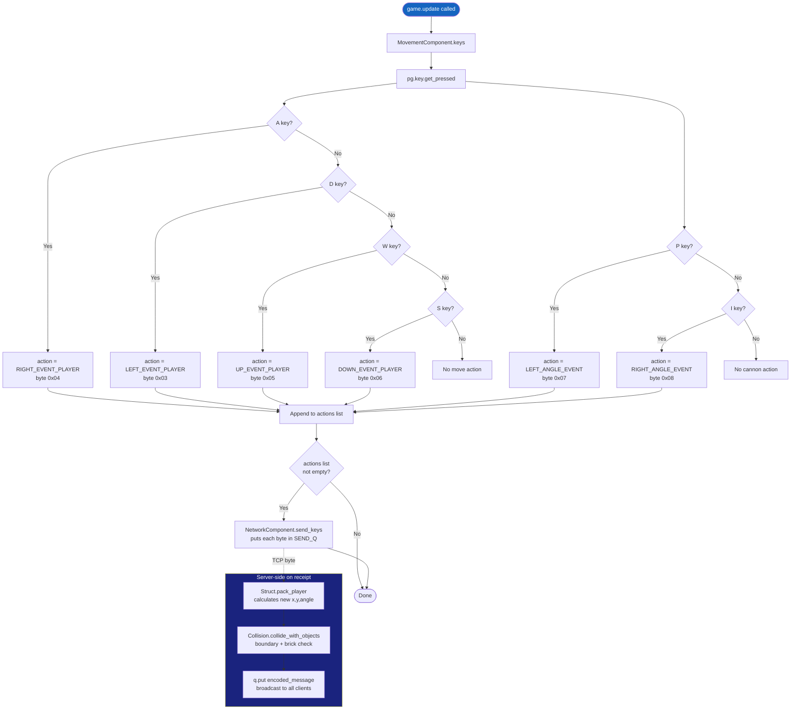

---

## 7. Firing & Bullet Lifecycle Flowchart

Firing involves both the client (visual bullet) and server (hit detection).

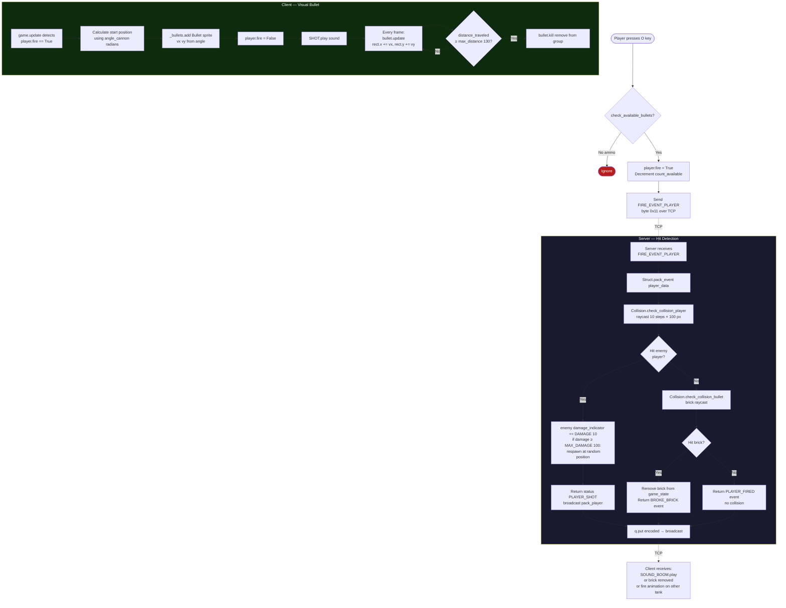

---

## 8. Collision Detection Flowchart

`Collision` is a server-side static class. It handles boundaries, bricks, blocks, and bullet hits.

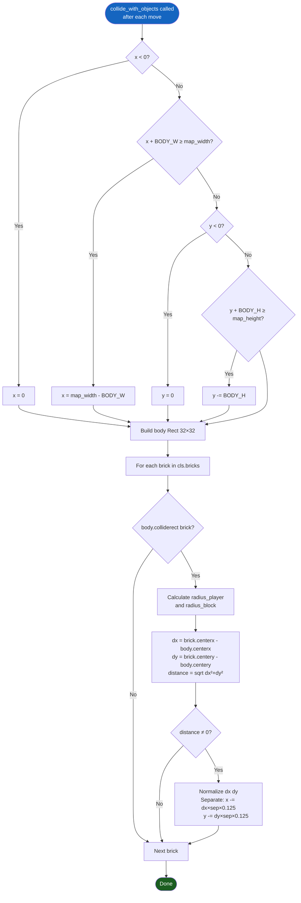

---

## 9. Ammo & Reload System Flowchart

`CannonType` tracks shot count and manages automatic reload after all bullets are spent.

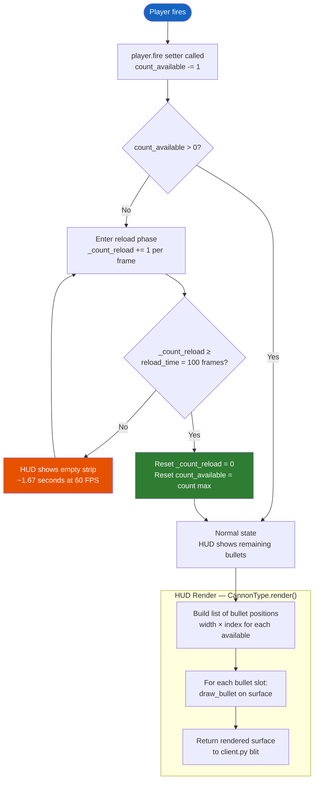

---

## 10. Fog of War (FOV) System Flowchart

The Fog of War renders a gray overlay with a smooth radial clear-zone centered on the local player. Implemented in `game.py` by contributor **kca**.

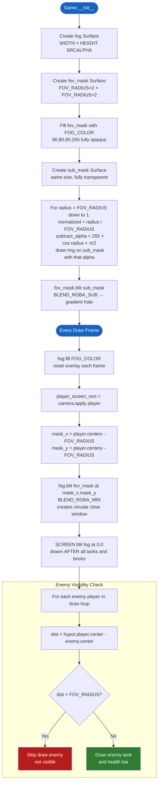

---

## 11. Laser Skill Flowchart

The laser is a toggleable skill bound to **L**. It activates a sight-line check but does not deal damage directly in the current implementation (server receives the event; client draws the beam locally via `get_laser_intersections`).

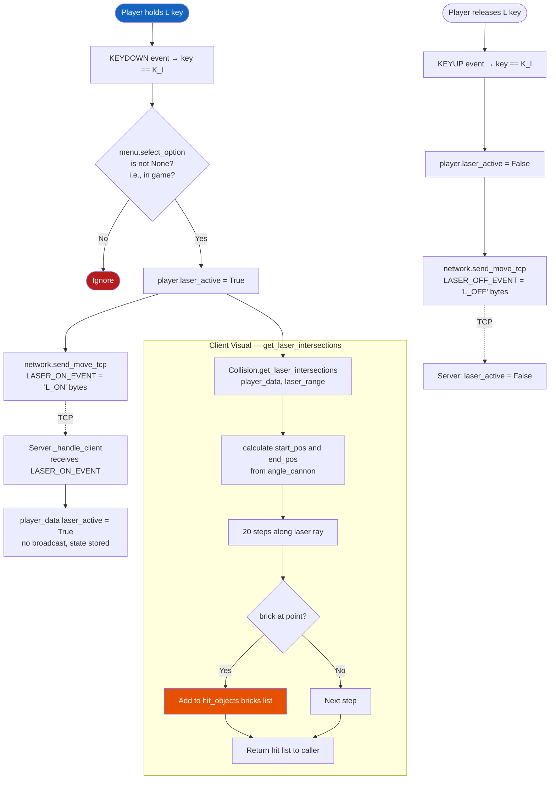

---

## 12. Network Communication Flowchart

Two dedicated background threads decouple send and receive from the game loop.

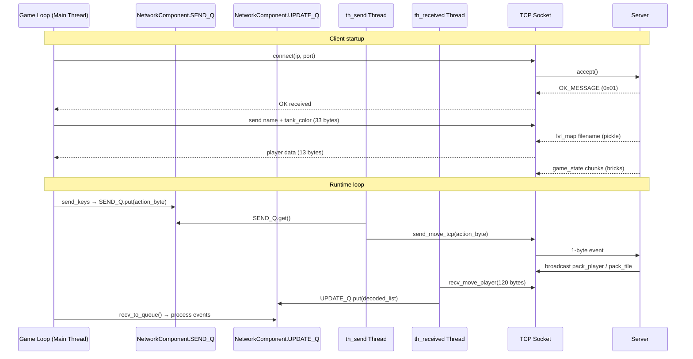

---

## 13. Player Connection & Session Flowchart

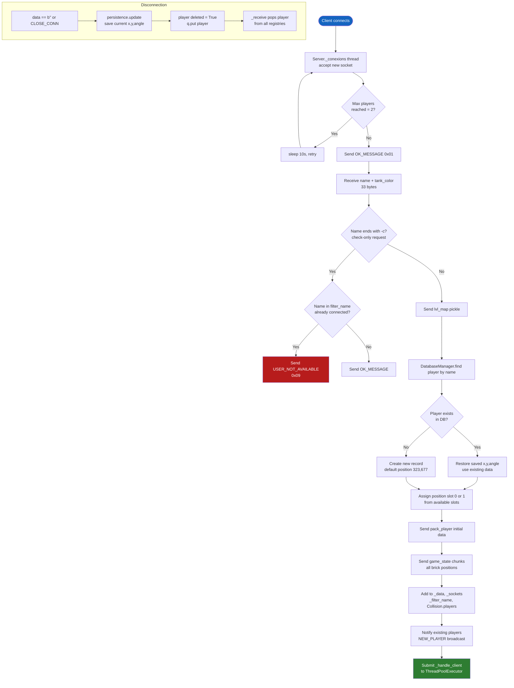

---

## 14. Game State Transition Flowchart

The `GameState` enum controls music and interaction. Lobby → Battle transition happens automatically after 5 minutes or on SPACE.

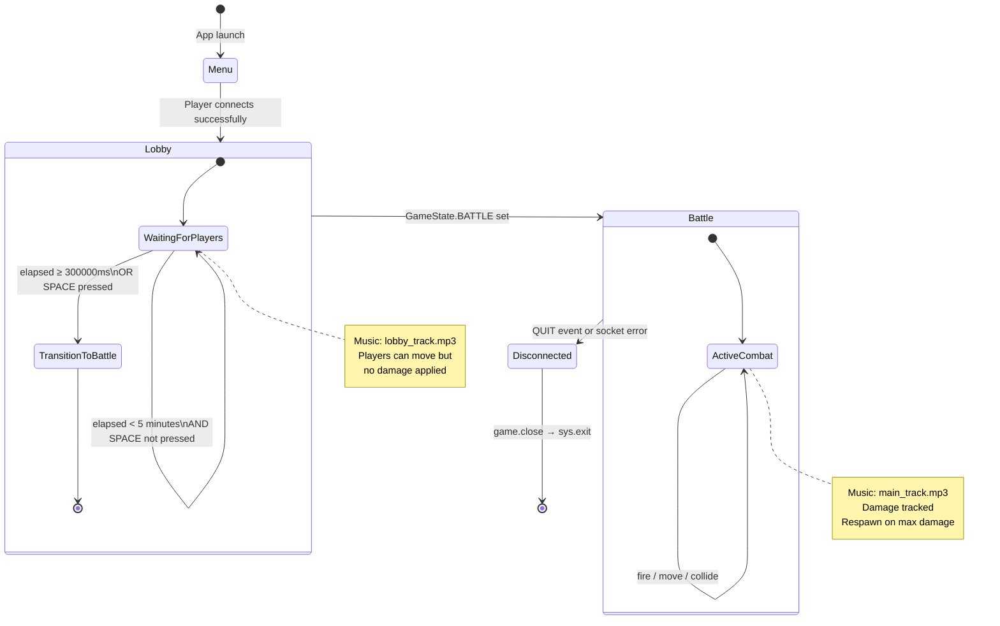

---

## 15. Data Packet Structure

All data is binary-packed using Python's `struct` module for performance.

### Player Update Packet (13 bytes)

| Byte(s) | Field | Format | Notes |
|---------|-------|--------|-------|
| 0 | Size marker | `B` | Always `13` (SIZE_PLAYER) |
| 1 | Status | `B` | 1=UPDATE, 2=NEW, 3=OLD, 7=SHOT, 8=FIRED |
| 2 | Position slot | `B` | 0 or 1 |
| 3–4 | X coordinate | `h` (int16) | World X |
| 5–6 | Y coordinate | `h` (int16) | World Y |
| 7–8 | Body angle | `h` (int16) | 0–359 degrees |
| 9–10 | Cannon angle | `h` (int16) | 0–359 degrees |
| 11 | Damage | `b` (int8) | 0–100 |
| 12 | Tank color | `B` | 0–23 (color index) |

### Tile / Event Packet (11 bytes)

| Byte(s) | Field | Format | Notes |
|---------|-------|--------|-------|
| 0 | Size marker | `B` | Always `11` (BUFFER_SIZE_EVENT_RESPONSE) |
| 1 | Type | `b` | 4=BROKE_BRICK, 5=BRICK, 6=BLOCK |
| 2–3 | X | `h` | Tile X |
| 4–5 | Y | `h` | Tile Y |
| 6–7 | Width | `h` | Tile width |
| 8–9 | Height | `h` | Tile height |

### Control Event Bytes (1 byte each)

| Byte | Constant | Action |
|------|----------|--------|
| `0x03` | LEFT_EVENT_PLAYER | Turn left |
| `0x04` | RIGHT_EVENT_PLAYER | Turn right |
| `0x05` | UP_EVENT_PLAYER | Move forward |
| `0x06` | DOWN_EVENT_PLAYER | Move backward |
| `0x07` | LEFT_ANGLE_EVENT_PLAYER | Rotate cannon left |
| `0x08` | RIGHT_ANGLE_EVENT_PLAYER | Rotate cannon right |
| `0x11` | FIRE_EVENT_PLAYER | Fire bullet |
| `0x01` | OK_MESSAGE | Handshake ACK |
| `0x09` | USER_NOT_AVAILABLE | Name conflict |
| `0x10` | CLOSE_CONN | Graceful disconnect |
| `L_ON` | LASER_ON_EVENT | Activate laser |
| `L_OFF` | LASER_OFF_EVENT | Deactivate laser |

---

*Documentation generated for DSA-Battle-Tanks-FINALS — May 2026*
